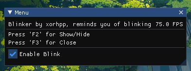

```
                   _______   ___        __    _____  ___   __   ___  _______   _______ 
                  |   _  "\ |"  |      |" \  (\"   \|"  \ |/"| /  ")/"     "| /"      \ 
                  (. |_)  :)||  |      ||  | |.\\   \    |(: |/   /(: ______)|:        |
                  |:     \/ |:  |      |:  | |: \.   \\  ||    __/  \/    |  |_____/   )
                  (|  _  \\  \  |___   |.  | |.  \    \. |(// _  \  // ___)_  //      / 
                  |: |_)  :)( \_|:  \  /\  |\|    \    \ ||: | \  \(:      "||:  __   \ 
                  (_______/  \_______)(__\_|_)\___|\____\)(__|  \__)\_______)|__|  \___)
 

                                     D3D11 ImGui External (x86 / x64)
                                     EXE / DLL ImGui External Menu
```
Thanks to [adamhlt/ImGui-Standalone](https://github.com/adamhlt/ImGui-Standalone) for the foundation.

---

## 📖 Project Overview

This project is a **DirectX 11 External Overlay** using **Dear ImGui**, capable of running in both:
- 🔵**EXE (standalone executable) mode**
- ⚪**DLL (injectable) mode**
---

## ✨ Features

- Fully functional **ImGui rendering** on top of any application (windowed)
- **Direct3D 11 backend**
- Example: fullscreen blinking with special overlay (idea by me)

---

## 🛠️ How to Build

1. Clone the repository
2. Open the solution
3. Build the project (Release x64)

---

## 🧪 Usage

- Press `F2` — Toggle menu
- Press `F3` — Exit application




If you are anoyed by the blinking, you can uncheck the checkbox in the menu.
